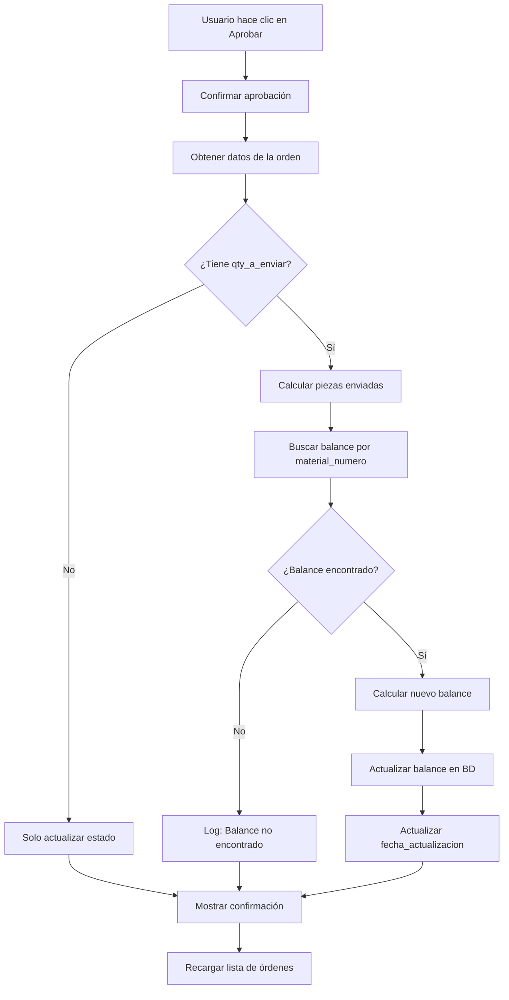

# Sistema de Balance Enviado vs Pedido

## 📋 Resumen de Implementación

Se ha implementado un sistema completo para diferenciar entre el **balance pedido** (lo que se solicitó en las OCIs) y el **balance enviado** (lo que realmente se recibió), con actualización automática de balances al aprobar órdenes.

**Fecha de implementación:** 19 de febrero de 2026  
**Versión:** 2.0  
**Commit:** `e2d48cd`

---

## 🎯 Funcionalidades Implementadas

### 1. Modificación de Interfaz en `oci_revisar.html`

#### a) Encabezado de Tabla
**Antes:**
```
Qty a Enviar
```

**Después:**
```
Total Real a Enviar (piezas)
```

#### b) Modal de Detalles (Botón "Ver")
**Antes:**
```
Qty a Enviar: 10 pallets
```

**Después:**
```
TOTAL REAL A ENVIAR
1,000 piezas
```
- Texto en **negrita, grande (18px) y subrayado**
- Color azul (#2563eb)
- Muestra piezas en lugar de pallets

#### c) Campo de Entrada
**Antes:**
- Aceptaba pallets
- Guardaba directamente el valor

**Después:**
- Acepta **piezas** directamente
- Convierte automáticamente a pallets al guardar
- Texto en negrita para mayor visibilidad
- Fórmula: `pallets = Math.ceil(piezas / piezas_por_pallet)`

#### d) Nueva Función: `guardarQtyEnviarPiezas()`
```javascript
async function guardarQtyEnviarPiezas(ordenId, cantidadPiezas, piezasPorPallet) {
    const cantidadPiezasNum = parseInt(cantidadPiezas) || 0;
    const cantidadPallets = Math.ceil(cantidadPiezasNum / piezasPorPallet);
    
    // Guarda en la BD como pallets
    await supabaseClient
        .from('ordenes_compra')
        .update({ qty_a_enviar: cantidadPallets })
        .eq('id', ordenId);
}
```

---

### 2. Nueva Columna en Balances Usados (`index.html` y `app.js`)

#### Estructura de la Tabla

| Columna | Descripción | Color Badge |
|---------|-------------|-------------|
| **Orden Compra** | Número de OC-MTK | - |
| **Material de Cartón** | Descripción del material | - |
| **Balance Inicial** | Balance con el que se dio de alta | Verde |
| **Balance Pedido** | Suma de piezas pedidas en OCIs | Rojo |
| **Balance Enviado** | Suma de piezas realmente enviadas | Verde |
| **OCIs Ligadas** | Badges de OCIs que usaron el balance | Azul |
| **Fecha Agotamiento** | Fecha del último uso | - |

#### Cálculos

**Balance Inicial:**
```javascript
balanceInicial = balance_actual + balance_pedido
```

**Balance Pedido:**
```javascript
balancePedido = Σ(cantidad_piezas_usadas) // de oci_balances_usados
```

**Balance Enviado:**
```javascript
balanceEnviado = Σ(qty_a_enviar × piezas_por_pallet) // de ordenes_compra APROBADAS
```

---

### 3. Actualización Automática de Balances al Aprobar OCI

#### Flujo de Aprobación



#### Código de la Función `aprobarOrden()`

```javascript
async function aprobarOrden(ociId) {
    // 1. Obtener datos de la orden
    const { data: orden } = await supabaseClient
        .from('ordenes_compra')
        .select('*')
        .eq('id', ociId)
        .single();

    // 2. Actualizar estado a APROBADA
    await supabaseClient
        .from('ordenes_compra')
        .update({ estado: 'APROBADA' })
        .eq('id', ociId);

    // 3. Actualizar balance si tiene qty_a_enviar
    if (orden.qty_a_enviar && orden.material_numero) {
        // Calcular piezas enviadas
        const piezasEnviadas = orden.qty_a_enviar * (orden.piezas_por_pallet || 1);

        // Buscar balance por material_numero
        const { data: balances } = await supabaseClient
            .from('balances_veritiv')
            .select('id, balance, producto:productos_carton(numero_parte)')
            .eq('activo', true);

        const balanceEncontrado = balances.find(b => 
            b.producto && b.producto.numero_parte === orden.material_numero
        );

        if (balanceEncontrado) {
            // Calcular nuevo balance
            const balanceActual = parseFloat(balanceEncontrado.balance);
            const nuevoBalance = balanceActual - piezasEnviadas;

            // Actualizar balance (evitar negativos)
            await supabaseClient
                .from('balances_veritiv')
                .update({ 
                    balance: nuevoBalance >= 0 ? nuevoBalance : 0,
                    fecha_actualizacion: new Date().toISOString()
                })
                .eq('id', balanceEncontrado.id);
        }
    }

    alert('Orden aprobada exitosamente\n\n✅ Balance actualizado automáticamente');
}
```

---

## 📊 Ejemplos Prácticos

### Ejemplo 1: Balance Completo Enviado

**Situación:**
- Balance inicial: 10,000 piezas
- OCI creada: 10,000 piezas (100 pallets × 100 pzs/pallet)
- Qty a enviar: 10,000 piezas (todo llegó)

**Proceso:**
1. Se crea OCI → Balance pedido: 10,000
2. Se ingresa qty a enviar: 10,000 piezas
3. Se aprueba OCI → Balance enviado: 10,000
4. **Nuevo balance disponible: 10,000 - 10,000 = 0** ✅

**Resultado en Balances Usados:**
| Balance Inicial | Balance Pedido | Balance Enviado |
|-----------------|----------------|-----------------|
| 10,000 | 10,000 | 10,000 |

---

### Ejemplo 2: Balance Parcial Enviado

**Situación:**
- Balance inicial: 10,000 piezas
- OCI creada: 10,000 piezas
- Qty a enviar: 9,500 piezas (faltaron 500)

**Proceso:**
1. Se crea OCI → Balance pedido: 10,000
2. Se ingresa qty a enviar: 9,500 piezas
3. Se aprueba OCI → Balance enviado: 9,500
4. **Nuevo balance disponible: 10,000 - 9,500 = 500** ✅

**Resultado en Balances Usados:**
| Balance Inicial | Balance Pedido | Balance Enviado | Balance Disponible |
|-----------------|----------------|-----------------|-------------------|
| 10,000 | 10,000 | 9,500 | 500 |

---

### Ejemplo 3: Múltiples OCIs

**Situación:**
- Balance inicial: 15,000 piezas
- OCI-001: 5,000 piezas pedidas → 4,800 enviadas
- OCI-002: 7,000 piezas pedidas → 7,000 enviadas
- OCI-003: 3,000 piezas pedidas → 2,900 enviadas

**Proceso:**
1. Se crean 3 OCIs → Balance pedido: 15,000
2. Se aprueban las 3 OCIs:
   - OCI-001: 15,000 - 4,800 = 10,200
   - OCI-002: 10,200 - 7,000 = 3,200
   - OCI-003: 3,200 - 2,900 = 300
3. **Balance final: 300 piezas** ✅

**Resultado en Balances Usados:**
| Balance Inicial | Balance Pedido | Balance Enviado | Balance Disponible | OCIs Ligadas |
|-----------------|----------------|-----------------|-------------------|--------------|
| 15,000 | 15,000 | 14,700 | 300 | OCI-001, OCI-002, OCI-003 |

---

## 🔍 Validaciones y Seguridad

### 1. Evitar Balances Negativos
```javascript
balance: nuevoBalance >= 0 ? nuevoBalance : 0
```
Si el balance calculado es negativo, se establece en 0.

### 2. Verificación de Datos
- Verifica que `qty_a_enviar` existe antes de actualizar
- Verifica que `material_numero` existe
- Busca el balance correspondiente antes de actualizar

### 3. Logs Detallados
```javascript
console.log('📝 Orden a aprobar:', orden);
console.log('🔄 Actualizando balance para material:', orden.material_numero);
console.log('📦 Piezas enviadas:', piezasEnviadas);
console.log('✅ Balance encontrado:', balanceEncontrado);
console.log(`📊 Balance actual: ${balanceActual}, Nuevo balance: ${nuevoBalance}`);
console.log('✅ Balance actualizado exitosamente');
```

### 4. Manejo de Errores
```javascript
try {
    // Proceso de aprobación
} catch (error) {
    console.error('Error:', error);
    alert('Error aprobando la orden: ' + error.message);
}
```

---

## 🧪 Casos de Prueba

### Caso 1: Aprobación Normal
**Entrada:**
- Balance disponible: 1,000 piezas
- Qty a enviar: 800 piezas

**Resultado esperado:**
- ✅ Balance actualizado a 200 piezas
- ✅ Mensaje de confirmación
- ✅ Logs en consola

### Caso 2: Balance Insuficiente
**Entrada:**
- Balance disponible: 500 piezas
- Qty a enviar: 800 piezas

**Resultado esperado:**
- ✅ Balance actualizado a 0 (no negativo)
- ⚠️ Log de advertencia en consola

### Caso 3: Sin Qty a Enviar
**Entrada:**
- Qty a enviar: vacío

**Resultado esperado:**
- ✅ OCI aprobada
- ℹ️ Balance no se actualiza
- ℹ️ Log: "No hay qty_a_enviar"

### Caso 4: Material No Encontrado
**Entrada:**
- Material_numero: no existe en balances

**Resultado esperado:**
- ✅ OCI aprobada
- ⚠️ Log: "No se encontró balance para el material"

---

## 📁 Archivos Modificados

### 1. `oci_revisar.html`
**Líneas modificadas:**
- 844: Encabezado de tabla
- 1008-1011: Cálculo de qty en piezas
- 1025-1033: Campo de entrada modificado
- 1119-1120: Modal de detalles
- 1391-1423: Nueva función `guardarQtyEnviarPiezas()`
- 1169-1252: Función `aprobarOrden()` modificada

**Cambios:**
- +85 líneas
- -15 líneas

### 2. `index.html`
**Líneas modificadas:**
- 1566-1574: Encabezados de tabla
- 1577-1581: Colspan actualizado

**Cambios:**
- +2 líneas
- -1 línea

### 3. `app.js`
**Líneas modificadas:**
- 3422-3454: Función `cargarBalancesUsados()` modificada
- 3484-3493: Renderizado con nueva columna
- 3589-3616: Función `filtrarBalancesUsados()` modificada
- 3632-3641: Renderizado en filtro
- Múltiples líneas: Actualización de colspan

**Cambios:**
- +85 líneas
- -20 líneas

---

## 🚀 Instrucciones de Uso

### Para el Usuario Final

#### 1. Crear una OCI
1. Accede a `oci_simple.html`
2. Crea una nueva OCI con materiales
3. El sistema registra el **balance pedido**

#### 2. Ingresar Cantidad Real a Enviar
1. Accede a `oci_revisar.html`
2. En la columna "Total Real a Enviar (piezas)", ingresa la cantidad **en piezas**
3. El sistema convierte automáticamente a pallets

#### 3. Aprobar la OCI
1. Haz clic en el botón "Aprobar"
2. Confirma la aprobación
3. El sistema:
   - Actualiza el estado a "APROBADA"
   - Descuenta las piezas del balance
   - Muestra confirmación

#### 4. Verificar en Balances Usados
1. Accede a `index.html` → Balance
2. Haz clic en la pestaña "Balances Usados"
3. Verifica:
   - Balance Inicial
   - Balance Pedido
   - Balance Enviado
   - OCIs Ligadas

---

## 🔧 Mantenimiento

### Consultas Útiles en Supabase

**Ver balances con diferencia entre pedido y enviado:**
```sql
SELECT 
    bv.orden_compra,
    bv.material_carton,
    bv.balance as balance_actual,
    COALESCE(SUM(obu.cantidad_piezas_usadas), 0) as balance_pedido,
    (
        SELECT COALESCE(SUM(oc.qty_a_enviar * oc.piezas_por_pallet), 0)
        FROM ordenes_compra oc
        WHERE oc.material_numero = pc.numero_parte
        AND oc.estado = 'APROBADA'
    ) as balance_enviado
FROM balances_veritiv bv
LEFT JOIN productos_carton pc ON bv.producto_id = pc.id
LEFT JOIN oci_balances_usados obu ON bv.id = obu.balance_id
GROUP BY bv.id, bv.orden_compra, bv.material_carton, bv.balance, pc.numero_parte;
```

**Ver OCIs aprobadas con qty_a_enviar:**
```sql
SELECT 
    numero_oci,
    material_numero,
    cantidad_pallets,
    piezas_por_pallet,
    qty_a_enviar,
    (qty_a_enviar * piezas_por_pallet) as piezas_enviadas,
    estado,
    fecha_creacion
FROM ordenes_compra
WHERE estado = 'APROBADA'
AND qty_a_enviar IS NOT NULL
ORDER BY fecha_creacion DESC;
```

---

## 📞 Soporte

### Problemas Comunes

**Problema:** El balance no se actualiza al aprobar
- **Causa:** No se ingresó qty_a_enviar
- **Solución:** Ingresar la cantidad antes de aprobar

**Problema:** Balance enviado no aparece en Balances Usados
- **Causa:** La OCI no está aprobada
- **Solución:** Aprobar la OCI desde oci_revisar.html

**Problema:** Balance quedó en negativo
- **Causa:** Bug en versión anterior (ya corregido)
- **Solución:** Actualizar manualmente el balance a 0

---

## 🎉 Beneficios del Sistema

### Para el Negocio
- ✅ Control preciso de inventario real vs pedido
- ✅ Visibilidad de diferencias entre lo pedido y lo recibido
- ✅ Auditoría completa de movimientos
- ✅ Prevención de sobregiros

### Para los Usuarios
- ✅ Proceso automatizado (menos errores)
- ✅ Interfaz clara y fácil de usar
- ✅ Feedback inmediato al aprobar
- ✅ Historial completo en Balances Usados

### Para el Sistema
- ✅ Integridad de datos garantizada
- ✅ Logs detallados para debugging
- ✅ Validaciones robustas
- ✅ Escalable y mantenible

---

## 📝 Notas Finales

- **Versión:** 2.0
- **Fecha de implementación:** 19 de febrero de 2026
- **Branch:** `contro-de-carton-1.2`
- **Commit:** `e2d48cd`
- **Estado:** ✅ Completado y en producción

**Desarrollado por:** Manus AI  
**Repositorio:** https://github.com/jcanett1/Controldecarton
